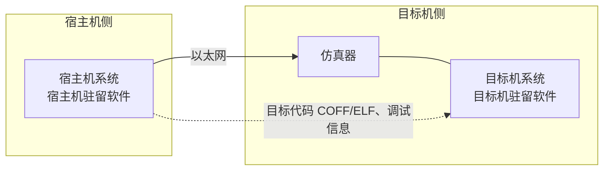

# 嵌入式软件开发与低功耗设计

## 嵌入式软件开发与传统开发的差异（8条）

★ 嵌入式软件的开发与传统的软件开发方法存在比较大的差异，主要表现在以下方面（讲义 p7）：

1. 在**宿主机**（PC 机或工作站）上使用专门的嵌入式工具开发，生成二进制代码后，需要使用工具下载（讲义原文作"卸载"）到**目标机**或**固化在目标机存储器**上运行；
2. 更强调**软/硬件协同工作**的效率和稳定性；
3. 开发结果通常需要**固化**在目标系统的存储器或处理器内部存储器资源中；
4. 一般需要专门的**开发工具、目标系统和测试设备**；
5. 对**实时性**的要求更高；
6. 对**安全性和可靠性**的要求较高；
7. 要充分考虑**代码规模**；
8. 在**安全攸关系统**中的嵌入式软件，其开发还应满足某些领域对设计和代码审定。

另附（讲义 p7 与差异条目同页，属设计方法而非差异）：**模块化设计**——将一个较大的程序按功能划分成若干程序模块，每个模块实现特定的功能。

## 交叉开发环境

宿主机与目标机指令系统不同、嵌入式系统资源紧缺，须借助一套交叉工具在宿主机上完成开发（讲义 p8）：

**工具列表（7 件）**：
- 交叉编译器
- 交叉链接器
- 调试器
- 动态装载器
- 链接装载器
- 调试监视器
- 调试代理

> [!info] 交叉开发环境示意图（讲义 p8）
> 宿主机驻留软件装入**宿主机系统**；宿主机系统经**以太网**连接**仿真器**与**目标机系统**；目标机驻留软件装入目标机系统；**目标代码（COFF、ELF）与调试信息**由宿主机侧流向目标机侧。

**交叉编译**：在一个平台上生成可以在另一个平台上执行的代码。不同体系结构有不同的指令系统，不同的 CPU 需要有相应的编译器。

**交叉工具链**：当宿主机与目标机的机器指令不同时，需要编译、汇编、链接等一整套工具（32h p19）。宿主机与目标机之间通常通过**串口、网络或 JTAG 接口**连接（32h p15）。

## JTAG

★ **JTAG**（Joint Test Action Group，联合测试工作组）是一种**国际标准测试协议**（**IEEE 1149.1** 兼容），主要用于**芯片内部测试和调试**（讲义 p8）。

## 低功耗软件设计（5 方面）

★ 嵌入式软件设计层面的功耗控制主要可以从以下方面展开（讲义 p9）：

1. **软硬件协同设计**：软件的设计要与硬件的匹配，考虑硬件因素；
2. **编译优化**：采用低功耗优化的编译技术；
3. **减少系统的持续运行时间**：可从算法角度进行优化；
4. 用"**中断**"代替"**查询**"；
5. 进行**电源的有效管理**。

> [!tip] 题眼
> 讲义 p10 习题答案 D「编译优化技术、软硬件协同设计和算法优化」三项均落在上面 5 方面之内；其余选项混入"代码优化/环境设计优化/仿真实验"等干扰项。

## 嵌入式软件开发流程（一本通浓缩条目）

- **宿主机与目标机**：嵌入式软件开发一般使用宿主机和目标机的模式进行系统开发。宿主机是指普通 PC 机中构建的开发环境，一般需要配置**交叉编译器**；目标机可以是嵌入式系统的实际运行环境，也可以是能够替代实际运行环境的仿真系统。
- **开发方式**：在宿主机上建立开发环境，完成编码和**交叉编译** → 在宿主机和目标机之间建立连接 → 将目标程序**下载**到目标机中进行**交叉调试**和运行。
- **交叉编译**：在一个平台上生成可以在另一个平台上执行的代码；如同翻译，把相同的程序代码翻译成不同 CPU 的对应可执行二进制文件。通用计算机资源丰富，嵌入式系统资源紧缺、无法运行编译工具，故须借宿主机编译出目标机的可执行代码。
- **交叉调试**：与通用软件调试差别大——常见软件开发中调试器与被调试程序运行在**同一台计算机**上（调试器是单独运行的进程，通过操作系统提供的调试接口控制被调试进程）；嵌入式交叉调试则分处宿主机与目标机两侧。

> [!tip] 来源：一本通 p52-53

## Related Notes
- [[练习题-嵌入式系统设计]]
- [[Exam-Traps]]
